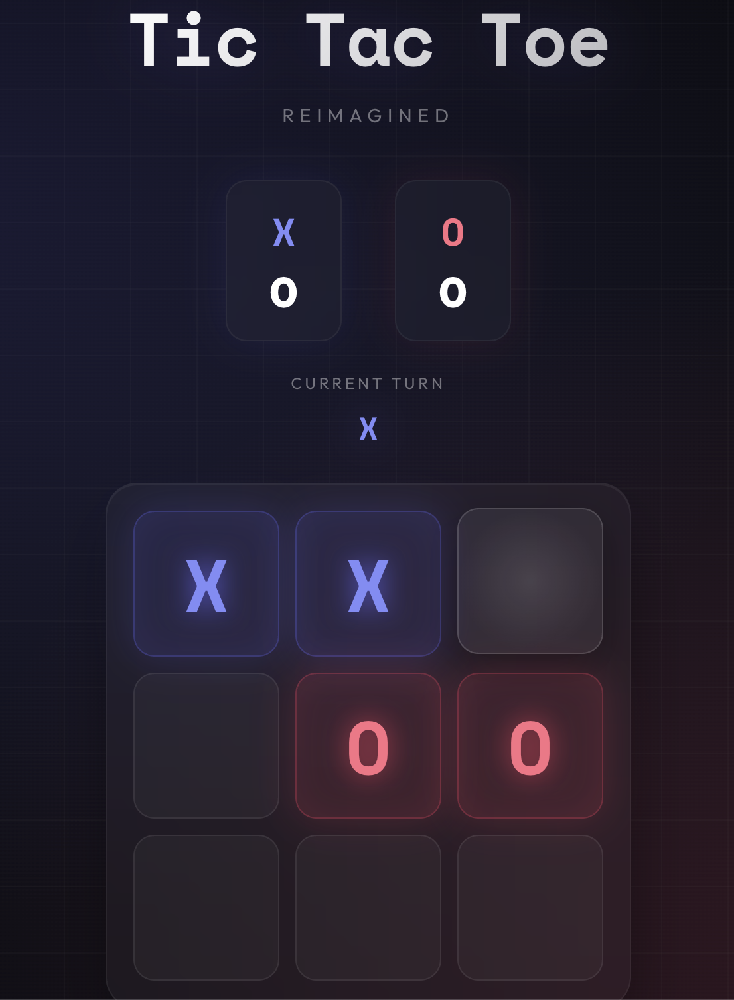

# Tic Tac Toe — Reimagined

A beautifully designed, modern Tic Tac Toe game built with React. Features a luxury neon arcade aesthetic with smooth animations and responsive design.




## ✨ Features

- **Beautiful Design** — Luxury neon arcade aesthetic with gradient glows
- **Smooth Animations** — Board entrance, mark spin-in, winning pulse effects
- **Score Tracking** — Persistent scores across game sessions
- **Responsive** — Works beautifully on mobile and desktop
- **Accessible** — ARIA labels and keyboard navigation support
- **Clean Architecture** — Separation of concerns with modular components

## 🚀 Quick Start

```bash
# Clone the repository
git clone https://github.com/g0zzy/tic-tac-toe.git

# Navigate to project directory
cd tic-tac-toe

# Install dependencies
npm install

# Start development server
npm run dev
```

The app will open at `http://localhost:3000`

## 📁 Project Structure

```
tic-tac-toe/
├── public/
│   └── favicon.svg
├── src/
│   ├── components/
│   │   ├── Board.jsx        # Game grid component
│   │   ├── Button.jsx       # Reusable button component
│   │   ├── Game.jsx         # Main game container
│   │   ├── Scoreboard.jsx   # Score display component
│   │   ├── Square.jsx       # Individual square component
│   │   ├── Status.jsx       # Game status display
│   │   └── index.js         # Component exports
│   ├── styles/
│   │   ├── animations.css   # Keyframe animations
│   │   ├── Board.css        # Board styles
│   │   ├── Button.css       # Button styles
│   │   ├── Game.css         # Game container styles
│   │   ├── Scoreboard.css   # Scoreboard styles
│   │   ├── Square.css       # Square styles
│   │   ├── Status.css       # Status styles
│   │   ├── variables.css    # CSS custom properties
│   │   └── index.css        # Style imports
│   ├── utils/
│   │   ├── gameLogic.js     # Pure game logic functions
│   │   └── index.js         # Utility exports
│   ├── App.jsx              # Root app component
│   └── main.jsx             # Entry point
├── index.html
├── package.json
├── vite.config.js
└── README.md
```

## 🏗️ Architecture

### Design Principles

1. **Separation of Concerns**
   - UI components are purely presentational
   - Game logic is extracted to pure utility functions
   - Styles are modular and component-scoped

2. **Single Responsibility**
   - Each component handles one thing
   - Utilities are pure functions with no side effects

3. **Component Composition**
   - Small, reusable components
   - Props for customization
   - Clean component hierarchy

### Key Files

| File | Purpose |
|------|---------|
| `utils/gameLogic.js` | Pure functions for game state management |
| `components/Game.jsx` | State management and orchestration |
| `components/Board.jsx` | Renders the 3x3 grid |
| `components/Square.jsx` | Individual clickable squares |
| `styles/variables.css` | Design tokens and CSS custom properties |

## 🎨 Design System

### Colors

| Token | Value | Usage |
|-------|-------|-------|
| `--color-x-primary` | `#818cf8` | Player X accent |
| `--color-o-primary` | `#fb7185` | Player O accent |
| `--color-bg-primary` | `#0a0a0f` | Dark background |

### Typography

- **Display Font**: Space Mono (marks, headings)
- **Body Font**: Outfit (UI text)

### Animations

- `titleGlow` — Alternating glow on title
- `boardAppear` — Board entrance animation
- `markAppear` — Mark placement spin
- `winPulse` — Winner status pulse
- `winningSquare` — Winning squares pulse

## 📜 Available Scripts

| Command | Description |
|---------|-------------|
| `npm run dev` | Start development server |
| `npm run build` | Build for production |
| `npm run preview` | Preview production build |
| `npm run lint` | Run ESLint |

## 🛠️ Tech Stack

- **React 18** — UI framework
- **Vite** — Build tool and dev server
- **CSS Modules** — Scoped styling
- **ESLint** — Code linting
- **PropTypes** — Runtime type checking

## 📄 License

Feel free to use this project for learning, educational purposes, or as a starting point for your own games!

---

Built with ❤️ and React
